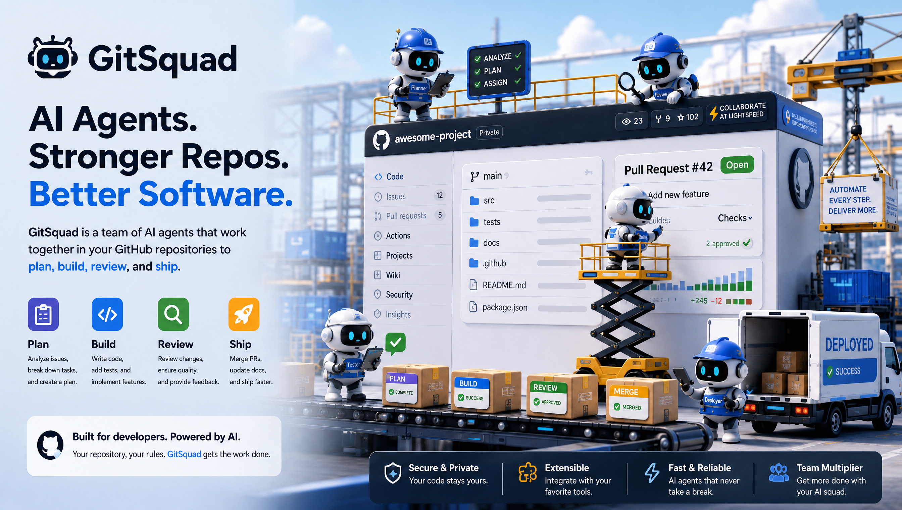

# GitSquad

**Your autonomous developer team on GitHub.**



[](https://github.com/feifeifeimoon/GitSquad/actions/workflows/ci.yml)
[](https://github.com/feifeifeimoon/GitSquad/releases)
[](https://go.dev/)
[](https://nextjs.org/)
[](e2e/README.md)
[](LICENSE)
[](CONTRIBUTING.md)

GitSquad is a multi-agent orchestration framework for autonomous software
development. Rather than driving one general-purpose assistant through every
step by hand, you describe the work once and a team of specialized agents
carries it: planning against the repository, editing code in a real checkout,
running a coding CLI that is already installed on a machine you control, and
pushing a branch that the platform turns into a pull request.

GitSquad is an orchestration shell — it does not implement an LLM tool loop of
its own. The agent loop stays in the coding CLI; GitSquad supplies the
blackboard, the routing, the execution environment, and the audit trail.

## How it works

1. **An issue on the blackboard.** Issues live in GitSquad rather than in
   GitHub's issue tracker, so the whole collaboration state — status, comments,
   agent mentions, task history — sits in one place. Each issue reaches a
   repository through its workspace.
2. **Mention an agent.** `@agent-name` in an issue or a comment resolves to a
   configured agent and dispatches a task to it.
3. **The task is routed.** Agents bound to a local runtime go to the daemon
   registered on that machine, which pulls the task over its own WebSocket
   connection and claims it.
4. **The agent runs.** The daemon clones the repository, assembles the brief and
   repository context into a per-task execution directory, and drives the
   installed coding CLI in headless streaming mode — so progress and token usage
   arrive as structured events instead of one blob of stdout at the end.
5. **You watch it happen.** Task progress, comments, and agent logs stream to the
   browser over a second WebSocket, so the issue is live rather than a page you
   have to refresh.
6. **It lands as a pull request.** The daemon pushes its branch and the platform
   opens the pull request against the workspace's default branch.

## Supported coding agents

<table>
  <tr>
    <td align="center" width="33%">
      <br>
      <sub><b>Claude Code</b></sub>
    </td>
    <td align="center" width="33%">
      <picture>
        <source media="(prefers-color-scheme: dark)" srcset="docs/assets/agents/codex-dark.svg">
        
      </picture><br>
      <sub><b>Codex</b></sub>
    </td>
    <td align="center" width="33%">
      <br>
      <sub><b>Antigravity</b></sub>
    </td>
  </tr>
</table>

The daemon probes the host for these CLIs on startup: `PATH` first, then a
per-provider override (`GITSQUAD_CLAUDE_PATH`, `GITSQUAD_CODEX_PATH`,
`GITSQUAD_AGY_PATH`), then a login shell, and finally any well-known bundle
locations. Adding a runtime is a single entry in
`internal/daemon/runtime_specs.go`; adding an execution adapter is one file in
`internal/daemon/provider/`.

| Provider | Slug | Detected | Execution adapter | Minimum version |
| :--- | :--- | :--- | :--- | :--- |
| Claude Code | `claude` | Yes | Streaming — `claude -p --output-format stream-json` | `2.0.0` |
| Codex | `codex` | Yes, including Codex Desktop bundles | Not yet — detection only | `0.100.0` |
| Antigravity | `agy` | Yes | Streaming — `agy -p --output-format stream-json` | — |

## Features

- **Issue blackboard** — a seven-state issue tracker with comments, `@mention`
  parsing, and a kanban board, scoped to a workspace.
- **Workspaces** — a GitHub App installation grants repository access; a
  workspace binds one repository to one agent team.
- **Agents and skills** — agents are personas bound to a runtime, with an
  optional per-agent model override; skills are structured, reusable
  instructions attached to agents.
- **Local execution with an audit trail** — the daemon owns the checkout and the
  child process, and reports progress, results, and failures back over its own
  connection.
- **Token accounting** — input, output, cache-read, and cache-write tokens are
  parsed out of each CLI's structured stream and rolled up per workspace.
- **Realtime console** — a WebSocket feed (`/ws/app`) pushes task, comment, and
  issue events so the board updates without polling.

## Architecture

```
                    browser
                       │  /ws/app (JWT)
                       ▼
   Next.js console ──► Go API server ────► PostgreSQL
                       │   ▲               (sqlc + pgx)
        GitHub App ◄───┘   │  /ws/daemon (daemon token)
       (webhooks, PRs)     │
                           ▼
                    gitsquad daemon
                           │
                  clone → execenv → provider adapter
                           │
                    claude / codex / agy
```

The backend is a strict `Handler → Service → Store` layering: HTTP concerns,
then business logic, then sqlc-generated queries. No raw SQL lives in Go. The
daemon is a separate binary that authenticates with its own token, holds a
persistent connection to the server, and executes each task inside its own
directory.

Design notes live in the repository rather than in this file:

| Document | Contents |
| :--- | :--- |
| [DESIGN.md](DESIGN.md) | The web console's design system — colour tokens, type scale, layout, component contracts. |
| [CONTRIBUTING.md](CONTRIBUTING.md) | Local setup, database and sqlc workflow, API conventions, environment variables. |
| [AGENTS.md](AGENTS.md) | Repository guide for AI coding agents: tech stack, directory map, architecture patterns, rules. |
| [e2e/README.md](e2e/README.md) | How the Playwright suite boots the real stack and seeds data. |

## Quick start

### Run the console and API from source

**Requirements:** Go 1.26+, PostgreSQL 16+, and [Bun](https://bun.sh/) for the
frontend. A Google OAuth client is required to sign in — register one at
<https://console.cloud.google.com/apis/credentials> with the redirect URI
`http://localhost:8080/api/v1/auth/google/callback`.

```bash
git clone https://github.com/feifeifeimoon/GitSquad.git
cd GitSquad

createdb gitsquad
cp .env.example .env
# Fill in GITSQUAD_GOOGLE_CLIENT_ID and GITSQUAD_GOOGLE_CLIENT_SECRET.

source .env
go run ./cmd/server          # → http://localhost:8080
```

```bash
cd web
bun install
bun run dev                  # → http://localhost:3000
```

### Install the CLI

The `gitsquad` CLI runs on any machine that should execute agent tasks.

```bash
# macOS / Linux
curl -fsSL https://raw.githubusercontent.com/feifeifeimoon/GitSquad/main/scripts/install.sh | bash
```

```powershell
# Windows (PowerShell)
irm https://raw.githubusercontent.com/feifeifeimoon/GitSquad/main/scripts/install.ps1 | iex
```

Then pair the machine and start the daemon:

```bash
gitsquad daemon login        # authenticate this machine
gitsquad daemon start        # run in the background
gitsquad daemon status       # health and detected runtimes
```

## Development

```bash
make check       # everything CI enforces: gofmt check, vet, Staticcheck, go test
make cover       # statement coverage for the Go packages
make vuln        # govulncheck, scanned for reachable vulnerabilities
make e2e-db      # start the local Postgres used by the E2E suite
make e2e         # boot the stack and run the Playwright suite
```

`make check` is the gate to run before every commit, and `make fmt` fixes
formatting for you. The frontend has its own commands, run from `web/` with Bun:
`bun run test`, `bun run lint`, `bun run build`. See
[CONTRIBUTING.md](CONTRIBUTING.md) for the database, sqlc, and environment
details, and [AGENTS.md](AGENTS.md) for the rules those gates enforce.

Repository layout at a glance:

```
cmd/          server (HTTP API) and gitsquad (CLI daemon) entrypoints
internal/     server (handlers, services, stores, WebSocket hubs) and daemon
              (client, execenv, provider adapters, runner)
pkg/types/    API types shared by both binaries
web/          Next.js console (Bun)
e2e/          Playwright browser tests (its own npm package)
```

## Contributing

Contributions are welcome. Please read [CONTRIBUTING.md](CONTRIBUTING.md) before
opening a pull request, and make sure `make check` and `bun run lint` pass.
Releases are built by GoReleaser and tagged `v*`; the backend deploys to Fly.io
from `main`.

## License

Apache License 2.0 — see [LICENSE](LICENSE).
