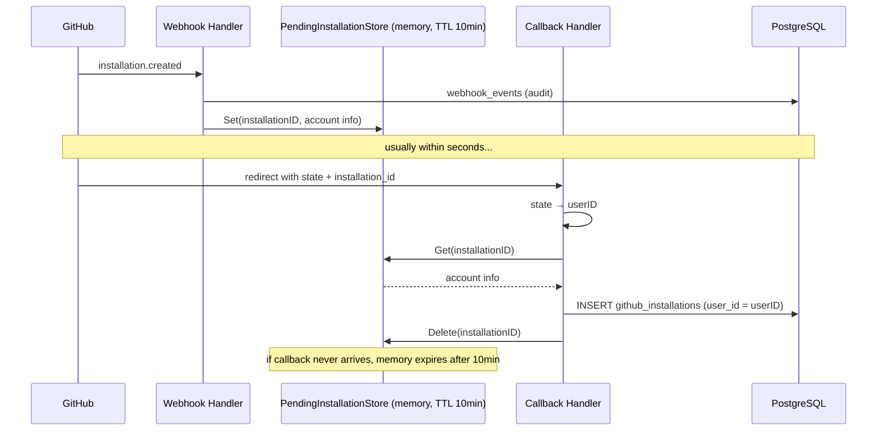

# GitHub App Webhook → Memory Bridge Design

> **Status:** Draft  
> **Date:** 2026-07-07  
> **Branch:** `feat/github-app`

## Problem

The GitHub App installation flow has two independent asynchronous channels:

1. **Webhook** (`installation.created`) — GitHub pushes an event, no user context
2. **Browser redirect** (callback with `state`) — has user context via `POST /prepare-install`

The original implementation had the webhook write directly to `github_installations` with `user_id = NULL`, then made those records visible to all users via `WHERE user_id = $1 OR user_id IS NULL`. This is wrong: unclaimed installations should not be visible, and the `github_installations` table should never contain unowned records.

The naive fix — removing `installation.created` handling entirely — breaks `installation_repositories` events that can arrive before the callback.

## Solution

**In-memory bridge** between webhook and callback. The webhook writes audit log + transient memory. The callback is the sole path to persistent `github_installations` records.

### Architecture



### Invariant

**Every row in `github_installations` has a non-null `user_id`.** The table never contains unclaimed records. `ListInstallationsByUser` queries with `WHERE user_id = $1` only.

## Webhook Event Handling

All webhook events are persisted to `webhook_events` first (audit, idempotent via `github_delivery_id`), then side effects are applied.

| Event | DB has record? | Only in memory? | Neither? |
|-------|---------------|-----------------|----------|
| `installation.created` | Ignore (dup) | Ignore (dup) | Save to memory |
| `installation.deleted` | Mark `revoked` | Delete from memory | Ignore |
| `installation_repositories` | `RefreshRepos()` | Update memory `repository_selection` | Ignore |
| `installation.suspend` | Mark `suspended` | Ignore | Ignore |
| `installation.unsuspend` | Mark `active` | Ignore | Ignore |
| `installation.new_permissions_accepted` | `RefreshRepos()` | Ignore | Ignore |
| `installation_target.renamed` | Update `account_login` | Ignore | Ignore |

### Race Scenarios

```
Normal:           webhook → memory → callback → DB
Callback first:   callback → DB (via API) → webhook → DB found → ignore
No webhook:       callback → memory miss → fetch from API → DB
No callback:      webhook → memory → 10min expiry → audit trail only
```

## Memory Store

### `PendingInstallationStore`

File: `internal/server/store/memory/state.go` (append to existing file, same pattern as `StateStore`)

```go
type PendingInstallation struct {
    InstallationID      int64
    AccountLogin        string
    AccountType         string
    RepositorySelection string
    CreatedAt           time.Time
}

type PendingInstallationStore struct {
    mu   sync.Mutex
    data map[int64]pendingEntry  // key = GitHub installation_id
}

// Methods:
func NewPendingInstallationStore() *PendingInstallationStore
    // Creates store, starts background reap goroutine

func (s *PendingInstallationStore) Set(id int64, p PendingInstallation)
    // Stores pending installation with 10-minute TTL

func (s *PendingInstallationStore) Get(id int64) *PendingInstallation
    // Returns nil if not found or expired

func (s *PendingInstallationStore) UpdateSelection(id int64, selection string)
    // Updates repository_selection for an existing pending entry

func (s *PendingInstallationStore) Delete(id int64)

func (s *PendingInstallationStore) reap()
    // Background goroutine, runs every minute, removes expired entries
```

TTL: 10 minutes. Same `sync.Mutex` + `time.Time` expiry pattern as the existing `StateStore`.

No `sender` fields — YAGNI. Can add later when GitHub OAuth identity matching is implemented.

## Service Changes

### `GitHubAppService`

New dependency on `*PendingInstallationStore`:

```go
type GitHubAppService struct {
    store   *store.Store
    cfg     config.Config
    pending *memory.PendingInstallationStore
}

func NewGitHubAppService(s *store.Store, cfg config.Config, pending *memory.PendingInstallationStore) *GitHubAppService
```

#### `CreateInstallation` (updated)

```go
func (s *GitHubAppService) CreateInstallation(
    ctx context.Context,
    installationID int64,
    userID uuid.UUID,
) (*db.GithubInstallation, error) {
    // 1. Try memory first for account metadata
    var accountLogin, accountType, repoSelection string
    if p := s.pending.Get(installationID); p != nil {
        accountLogin  = p.AccountLogin
        accountType   = p.AccountType
        repoSelection = p.RepositorySelection
    } else {
        // 2. Fallback: fetch from GitHub API
        client, _ := s.newAppClient()
        inst, _, err := client.Apps.GetInstallation(ctx, installationID)
        if err != nil {
            return nil, fmt.Errorf("get installation: %w", err)
        }
        if inst.Account != nil {
            accountLogin = inst.Account.GetLogin()
            accountType  = inst.Account.GetType()
        }
        if inst.RepositorySelection != nil {
            repoSelection = *inst.RepositorySelection
        }
    }

    // 3. Upsert to DB (always with userID)
    installation, err := s.store.CreateInstallation(ctx, db.CreateInstallationParams{
        UserID:              &userID,
        InstallationID:      installationID,
        AccountLogin:        accountLogin,
        AccountType:         accountType,
        RepositorySelection: repoSelection,
    })
    if err != nil {
        return nil, fmt.Errorf("create installation: %w", err)
    }

    // 4. Sync repos from GitHub API (always fresh)
    instClient, _ := s.newInstallationClient(ctx, installationID)
    if instClient != nil {
        _ = s.syncRepos(ctx, instClient, installation.ID, installationID)
    }

    // 5. Clean memory
    s.pending.Delete(installationID)

    return &installation, nil
}
```

#### `handleInstallationCreated` (restored, new behavior)

```go
func (s *GitHubAppService) handleInstallationCreated(ctx context.Context, payload []byte) {
    var ev github.InstallationEvent
    if err := json.Unmarshal(payload, &ev); err != nil {
        slog.Warn("parse installation.created", "error", err)
        return
    }

    inst := ev.Installation
    installationID := inst.GetID()

    // Check if already in DB (callback arrived first)
    existing, _ := s.store.GetInstallation(ctx, installationID)
    if existing.ID != uuid.Nil {
        slog.Info("installation.created ignored, already in DB",
            "installation_id", installationID)
        return
    }

    // Save to memory bridge
    s.pending.Set(installationID, memory.PendingInstallation{
        InstallationID:      installationID,
        AccountLogin:        inst.GetAccount().GetLogin(),
        AccountType:         inst.GetAccount().GetType(),
        RepositorySelection: inst.GetRepositorySelection(),
        CreatedAt:           time.Now(),
    })

    slog.Info("installation.created saved to memory",
        "installation_id", installationID)
}
```

#### `handleInstallationDeleted` (updated — check memory too)

Must check both DB and memory. If only in memory (callback hasn't arrived), delete from memory and log.

#### `handleInstallationReposChanged` (updated — check memory too)

If installation not in DB but found in memory, update `repository_selection` in memory so callback gets the latest value.

## Handler Changes

### `GitHubHandler`

Constructor changes:

```go
func NewGitHubHandler(
    cfg config.Config,
    g *service.GitHubAppService,
) *GitHubHandler {
    return &GitHubHandler{
        cfg:       cfg,
        githubSvc: g,
        states:    memory.NewStateStore(),
    }
}
```

The `PendingInstallationStore` is owned by the service now, not the handler.

### `Callback` (already fixed in prior work)

State validation — refuses to create installation without valid state. Redirects with `?error=invalid_state` instead of creating unowned records.

## DB Schema

### `github_installations.user_id`

Change back to `NOT NULL`:

```sql
user_id UUID NOT NULL REFERENCES users(id),
```

Since every installation record is now created via callback with a valid user, the column should enforce this invariant at the database level.

Migration 007 already creates the column. Migration 011 (ALTER to nullable) was removed in prior work. Revert migration 007 back to `NOT NULL`.

### SQL Queries (no change from prior fix)

```sql
-- CreateInstallation: uses plain EXCLUDED.user_id (no COALESCE needed)
-- ListInstallationsByUser: WHERE user_id = $1 (no OR user_id IS NULL)
```

These were already fixed in the prior cleanup pass.

## Implementation Tasks

1. **Add `PendingInstallationStore`** — append to `internal/server/store/memory/state.go`
2. **Restore `installation.created` handling** — in `service/github.go`, with memory-bridge behavior
3. **Update `handleInstallationDeleted`** — check memory if DB miss
4. **Update `handleInstallationReposChanged`** — check memory if DB miss, update selection
5. **Update `CreateInstallation`** — accept `*PendingInstallationStore`, check memory before API
6. **Wire up** — pass `PendingInstallationStore` to `NewGitHubAppService` in `routes.go`
7. **Revert `user_id` to NOT NULL** — migration 007
8. **Build & vet** — `go build ./... && go vet ./...`
